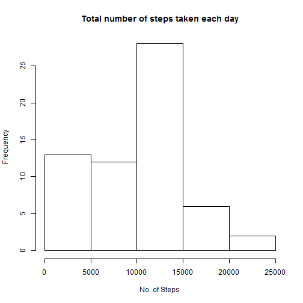
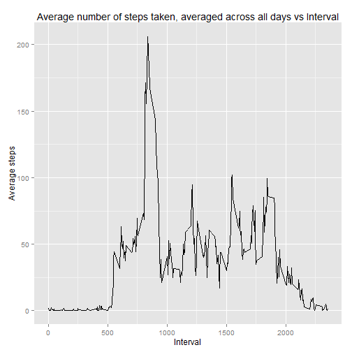
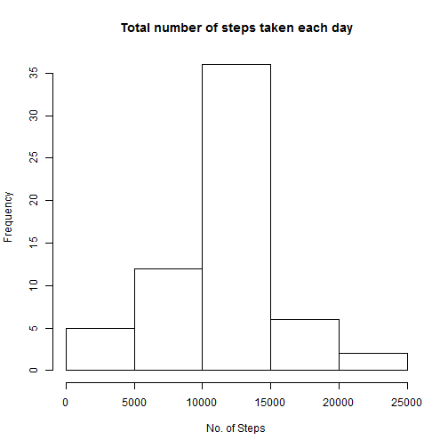
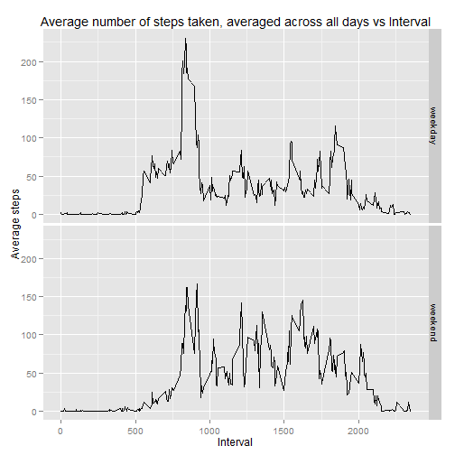

## Loading and preprocessing the data
### 1.Load the data (i.e. read.csv() )

```r
activity <- read.csv("activity.csv")
```

### 2.Processing interval to hh:mm format

```r
library(ggplot2)

hour<-as.integer(activity$interval/100) #hour part of interval
minute<-activity$interval-(hour*100) #minute part of interval

##To convert hour in 2-character(hh) format
interval_new<-NULL
for(i in hour){
  if(i<10)
    i<-paste("0",i,sep="")
  interval_new<-c(interval_new,i)
}
hour<-interval_new

#To convert minute in 2-character(mm) format
interval_new<-NULL
for(i in minute){
  if(i<10)
    i<-paste("0",i,sep="")
  interval_new<-c(interval_new,i)
}
minute<-interval_new

#Modifying interval column in hh:mm format using hour and minute 
activity$interval<-paste(hour,minute,sep=":")

#Converting interval to factor 
activity<-transform(activity,interval=factor(interval))
```

## The mean total number of steps taken per day
### 1.Histogram of the total number of steps taken each day

```r
d0<-tapply(activity$steps,activity$date,sum,na.rm=TRUE)
hist(d0,main="Total number of steps taken each day",xlab="No. of Steps")
```

 

### 2.The mean and median total number of steps taken per day respectively  are

```r
mean(d0)
```

```
## [1] 9354.23
```

```r
median(d0)
```

```
## [1] 10395
```

## The average daily activity pattern
### 1.Time series plot (i.e. type = "l") of the 5-minute interval (x-axis)and the average number of steps taken, averaged across all days (y-axis)


```r
average_over_all<-aggregate(activity$steps,by=list(activity$interval),mean,na.rm=TRUE)
names(average_over_all)<-c("interval","avg_steps")
qplot(as.numeric(gsub(":","",interval)),avg_steps,data=average_over_all,geom="line",ylab="Average steps",xlab='Interval',main='Average number of steps taken, averaged across all days vs Interval')
```

 

### 2.The 5-minute interval, on average across all the days in the dataset,contains the maximum number of steps is

```r
sum_over_all<-aggregate(activity$steps,by=list(activity$interval),sum,na.rm=TRUE)
names(sum_over_all)<-c("interval","total_steps")
sum_over_all[which.max(sum_over_all$total_steps),]
```

```
##     interval total_steps
## 104    08:35       10927
```

## Imputing missing values

### 1. The total number of missing values in the dataset


```r
sum(as.numeric(is.na(activity$steps)))
```

```
## [1] 2304
```

### 2.Strategy Used:
### A 'NA' value in number os steps is replaced by the mean for the 5-minute interval the observation belong to.


### 3. Creation of a new dataset that is equal to the original dataset but with the missing data filled in

```r
new_data<-merge(activity,average_over_all,by="interval")
new_data[is.na(new_data$steps),]$steps<-new_data[is.na(new_data$steps),]$avg_steps
new_data<-new_data[c("steps","date","interval")]
```
### 4. Histogram of the total number of steps taken each day and Calculate and report the mean and median total number of steps taken per day. 

```r
d1<-tapply(new_data$steps,new_data$date,sum)
hist(d1,main="Total number of steps taken each day",xlab="No. of Steps")
```

 

```r
mean(d1)
```

```
## [1] 10766.19
```

```r
median(d1)
```

```
## [1] 10766.19
```

## Differences in activity patterns between weekdays and weekends?
### 1.Creating a new factor variable in the dataset with two levels ??? ???weekday???and ???weekend??? indicating whether a given date is a weekday or weekend day.

```r
days<-weekdays(as.Date(new_data$date))
days[days=="Saturday"|days=="Sunday"]<-"weekend"
days[days!="weekend"]<-"weekday"
days<-as.factor(days)
new_data<-cbind(new_data,days)
```
### 2. A panel plot containing a time series plot (i.e. type = "l") of the 5-minute interval (x-axis) and the average number of steps taken, averaged across all weekday days or weekend days (y-axis).


```r
average_over_all_days<-aggregate(new_data$steps,by=list(new_data$interval,new_data$days),mean)
names(average_over_all_days)<-c("interval","days","avg_steps")
qplot(as.numeric(gsub(":","",interval)),avg_steps,data=average_over_all_days,facets=days~.,geom="line",ylab="Average steps",xlab='Interval',main='Average number of steps taken, averaged across all days vs Interval')
```

 
